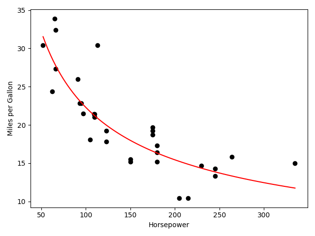

# PyRat

R-like vectors and functions in Python.

## Warning

This is not Pandas, or scikit-learn, or numpy. This is not R, either. Do not
use this for industry purposes. Do not use this unless you want your project to
break.

Simply have fun with it, or use this for educational purposes.

## Installation

Clone this repository to your local machine with git, then install with Python.

```bash
git clone https://github.com/shanedrabing/pyrat.git
cd pyrat
python setup.py install
```

## Getting Started

Import the libraries with Python.

```python
import pyrat.base
import pyrat.stats
import pyrat.utils
import pyrat.closure
```

The closure library is the only not inspired by R. All other libraries contain
familiar functions. If you want to locate a function within R, look into the
`find` function, determine the namespace, and see if PyRat contains the
function!

## Motivating Examples

So, why use PyRat? If you're a fan of R (like myself), you may have learned
that the capabilities of vectors and functions that operate on them are
immensely powerful.

### Linear Modeling

Let's try modeling a line of best fit between horsepower and miles per gallon
from the `mtcars` dataset:

```python
from pyrat.base import log10, seq
from pyrat.stats import lm, predict
from pyrat.utils import read_csv, struct

# load in data as a dict of vectors
# (not a true dataframe)
df = read_csv("data/mtcars.csv")

# examine the structure
# (like `str` in R)
struct(df)
```

Notice that `read_csv` auto-casts each vector to an inferred type (strict, no
NA support yet). Let's take a look at `struct`'s output:

```txt
 mpg : float  21.0, 21.0, 22.8, 21.4, 18.7, 18.1, 14.3, 24.4, 22.8, 19.2 ...
 cyl : int    6, 6, 4, 6, 8, 6, 8, 4, 4, 6 ...
disp : float  160.0, 160.0, 108.0, 258.0, 360.0, 225.0, 360.0, 146.7, 140.8, 167.6 ...
  hp : int    110, 110, 93, 110, 175, 105, 245, 62, 95, 123 ...
drat : float  3.9, 3.9, 3.85, 3.08, 3.15, 2.76, 3.21, 3.69, 3.92, 3.92 ...
  wt : float  2.62, 2.875, 2.32, 3.215, 3.44, 3.46, 3.57, 3.19, 3.15, 3.44 ...
qsec : float  16.46, 17.02, 18.61, 19.44, 17.02, 20.22, 15.84, 20.0, 22.9, 18.3 ...
  vs : int    0, 0, 1, 1, 0, 1, 0, 1, 1, 1 ...
  am : int    1, 1, 1, 0, 0, 0, 0, 0, 0, 0 ...
gear : int    4, 4, 4, 3, 3, 3, 3, 4, 4, 4 ...
carb : int    4, 4, 1, 1, 2, 1, 4, 2, 2, 4 ...
```

We can see the first 10 items in each vector, as well as an inferred type (not
perfect). Let's grab a couple of the variables from the dictionary and fit a
simple linear model:

```python
# value of our dict are vectors
x = df["hp"]
y = df["mpg"]

# can use vectorized functions
# (log10 transformation)
m = lm(log10(x), log10(y))

# what are our coefficients?
print(m)
```

And here are the outputted beta coefficients:

```txt
{'b1': -0.5300919470365705, 'b0': 2.4083283820957373}
```

Finally, let's predict some new data from the model:

```python
# R-like `seq` function
x_new = seq(min(x), max(x), length_out=101)

# predict a line of best fit,
# transform back to linear scale
y_new = 10 ** predict(m, log10(x_new))
```

How about a cool plot?

```python
import matplotlib.pyplot as plt

plt.scatter(x, y, color="black")
plt.plot(x_new, y_new, color="red")
plt.xlabel("Horsepower")
plt.ylabel("Miles per Gallon")
plt.tight_layout()
plt.savefig("data/fit.png")
plt.clf()
```



### Functional Programming

```python
from pyrat.base import c, paste

wiki = "https://en.wikipedia.org/w/index.php?search={}"
taxa = c("Canis lupus", "Felis catus", "Ursidae", "Anura (order)")

out = (
    taxa
    .apply(wiki.format)
    .thread(requests.get)
    .apply(getattr, "content")
    .apply(bs4.BeautifulSoup, "lxml")
    .apply(bs4.BeautifulSoup.select_one, "h1")
    .apply(getattr, "text")
    .transform(paste, "(" + taxa + ")", collapse="\n")
)
```

```txt
Wolf (Canis lupus)
Cat (Felis catus)
Bear (Ursidae)
Frog (Anura (order))
```
